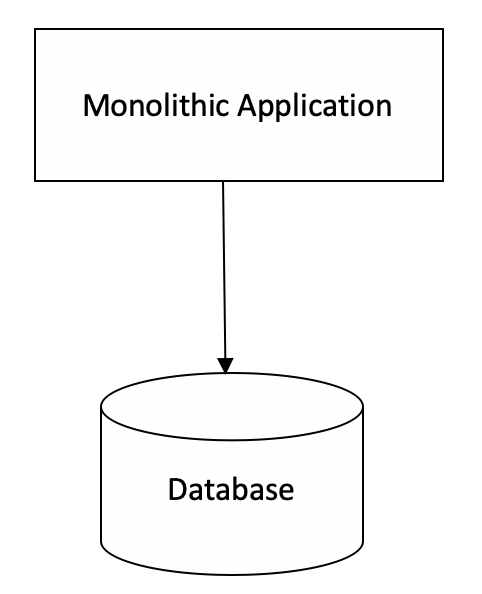

# SoftwareArchitecture

**Monolithic Architecture**
Monolithic Architecture is the classic way of software development. In a monolithic application all components are built as a single code base and deployed as a single file.
If any code updates are required, then those updates can’t be accommodated independently. Developer has to use the same code base, make the required code changes and then re-deploy the updated code. So even if a single change is required, the whole code base is touched and re-deployed

**Type of Monolithic Architecture**
1) **Single Process Monolithic Architecture:**
   If all code of an application is deployed as a single process, then this type of architecture is called Single Process Monolithic Architecture.

2) **Modular Monolithic Architecture:**
   A single application process consists of multiple modules. Each of these modules can work independently. The modules have interfaces and can communicate with each other through these interfaces. The underlying database is the same, and all of the modules use the same database for all operations. But still, all of the modules need to be combined in to form a single file for deployment.

Example :- One of the great examples of the organizations who have used this architecture is Shopify.

**Monolithic architecture has its Pros and Cons.**

**Advantages of Monolithic Architecture:**

1) It’s simple to develop as there is either no modularity or less formal modularity.
2) It’s easy to deploy as one single file is deployed.
3) There are less security concerns as software consists of single code base.
4) Because of the single code base, there is no network latency so application has better performance.
5) It’s easy to track bugs and do end-to-end testing because of single code base.

**Disadvantages of Monolithic Architecture:**

1) When a bug affects a single aspect of the codebase, it affects everything.
2) Even if a small change is required, then whole application needs to be redeployed.
3) Thorough regression testing is required even if a small change is made.
4) You cannot scale the components, you have to scale the whole application. So if a single feature of the application is facing users load, and we have to deploy the feature on multiple servers for load-balancing then we can’t deploy that single feature/module on a separate server. We have to deploy the whole application on the separate server. This is very inefficient use of resources.
5) There are technology up-gradation barriers. If you want to use a new technology or framework, you can’t do that in part of the application. You have to re-write the whole application.
6) As codebase size increases, it becomes difficult to manage code and overall deployment time also increases.
7) If a new developer joins the project, it’s very difficult for him to understand the code and workflows.